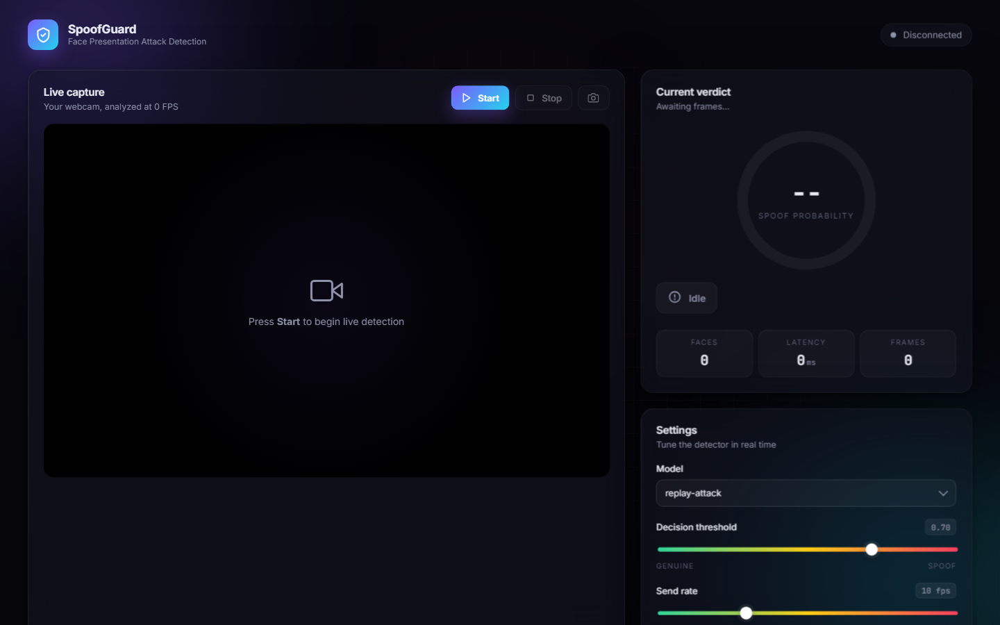
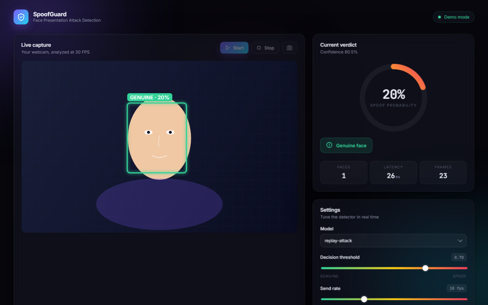
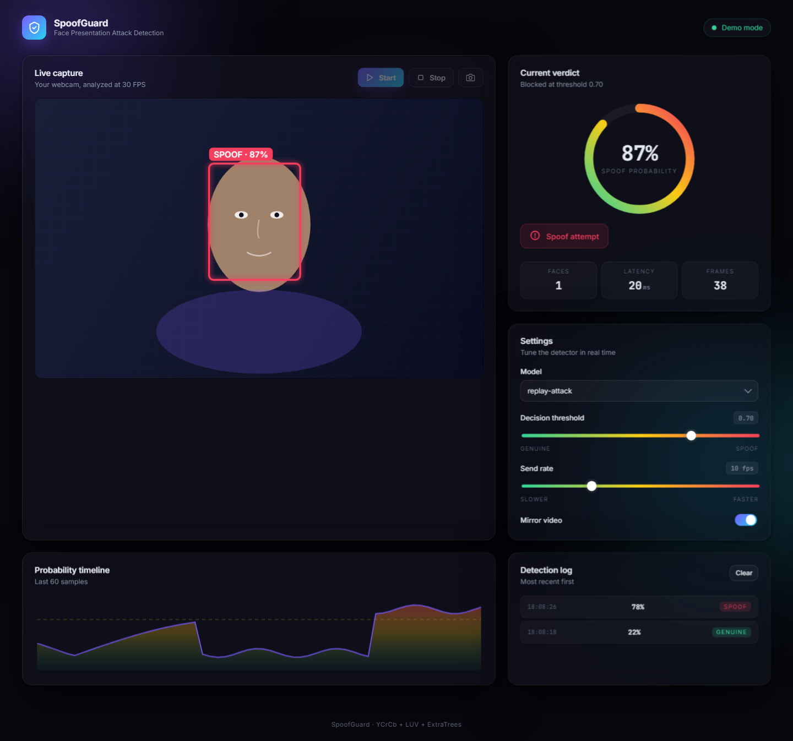
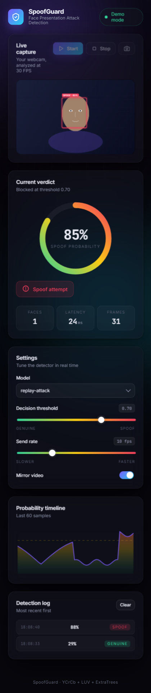

# SpoofGuard - Face Anti-Spoofing and Liveness Detection

> Real-time presentation attack detection separating a live face from a photo, screen or mask.

Built by **[Muhammad Tanveer](https://www.linkedin.com/in/muhammad-tanveer-advenno/)** - Full-Stack AI Automation Engineer.

 

## Contents

- [The problem](#the-problem)
- [The approach](#the-approach)
- [Architecture](#architecture)
- [Tech stack](#tech-stack)
- [Key capabilities](#key-capabilities)
- [Screenshots](#screenshots)
- [Results](#results)
- [FAQ](#faq)
- [Source code and access](#source-code-and-access)
- [About the engineer](#about-the-engineer)
- [Related projects](#related-projects)

## The problem

Face recognition answers whether a face matches, not whether it is a real face. Without liveness detection, a printed photo or a phone screen defeats the system entirely.

## The approach

A trained model that classifies presentation attacks in real time from the camera stream, distinguishing a live face from print, replay and mask attacks. It sits in front of recognition so a spoofed input is rejected before identity is ever considered.

## Architecture

| Component | Responsibility |
| --- | --- |
| **Capture** | Real-time camera stream |
| **Detection model** | Trained presentation-attack classifier |
| **Decision layer** | Live or spoof classification before recognition |
| **Application** | Demonstration interface over the model |

## Tech stack

| Layer | Technology |
| --- | --- |
| Vision | Deep learning classification models |
| Runtime | Real-time inference |
| Interface | JavaScript demonstration application |
| Models | Packaged trained weights |

## Key capabilities

- Real-time liveness classification
- Print, replay and mask attack detection
- Pre-recognition rejection of spoofed input
- Packaged trained models

## Screenshots

## Results

- Recognition protected against the attacks it cannot detect itself
- Classification fast enough to run in the live capture path

## FAQ

### What is a presentation attack?

Presenting something other than a live face - a printed photo, a video on a screen, or a mask - to fool a face recognition system.

### Why is liveness separate from recognition?

Recognition only answers whether two faces match. Liveness answers whether the input is a real person at all.

### Does it run in real time?

Yes - classification happens in the live capture path, before recognition.

### Is the source available?

Private repository.

## Source code and access

This repository is the public case study for **SpoofGuard - Face Anti-Spoofing and Liveness Detection**. The full implementation - application code, database schema, tests and deployment configuration - lives in a **private repository** on this account, alongside the rest of the work shown here.

Source access can be arranged for hiring conversations, technical review or client due diligence. The quickest route is a short message on [LinkedIn](https://www.linkedin.com/in/muhammad-tanveer-advenno/) or an email to [mtanveertahir6666@gmail.com](mailto:mtanveertahir6666@gmail.com).

## About the engineer

**Muhammad Tanveer - Full-Stack AI Automation Engineer**

Full-stack AI automation engineer. I build agentic systems, browser and workflow automation, RAG pipelines and the production web platforms they run on - from Rust and Python services to Next.js dashboards and PHP/MySQL business systems.

- GitHub: [haddindeve](https://github.com/haddindeve)
- LinkedIn: [Muhammad Tanveer](https://www.linkedin.com/in/muhammad-tanveer-advenno/)
- Email: [mtanveertahir6666@gmail.com](mailto:mtanveertahir6666@gmail.com)
- Location: Pakistan

## Related projects

- [Hafiz Fabrics - Retail POS and ERP](https://github.com/haddindeve/hafiz-fabrics-pos-erp)
- [ARMenu - Augmented Reality Restaurant Menu SaaS](https://github.com/haddindeve/armenu-augmented-reality-menu-saas)
- [Tahir Collection - Stockinette Manufacturer Web Platform](https://github.com/haddindeve/tahir-collection-stockinette-manufacturer)
- [Business OS - AI-Native Multi-Branch ERP](https://github.com/haddindeve/business-os-multi-branch-erp)
- [Advenno - Agency Platform with Client and Employee Portals](https://github.com/haddindeve/advenno-agency-saas-platform)
- [Gym Management CRM with NFC Gate Control](https://github.com/haddindeve/gym-management-crm-system)

---

SpoofGuard - Face Anti-Spoofing and Liveness Detection - case study by Muhammad Tanveer - Full-Stack AI Automation Engineer. Keywords: face anti-spoofing, liveness detection, presentation attack detection, biometric security, computer vision deep learning, face recognition security.